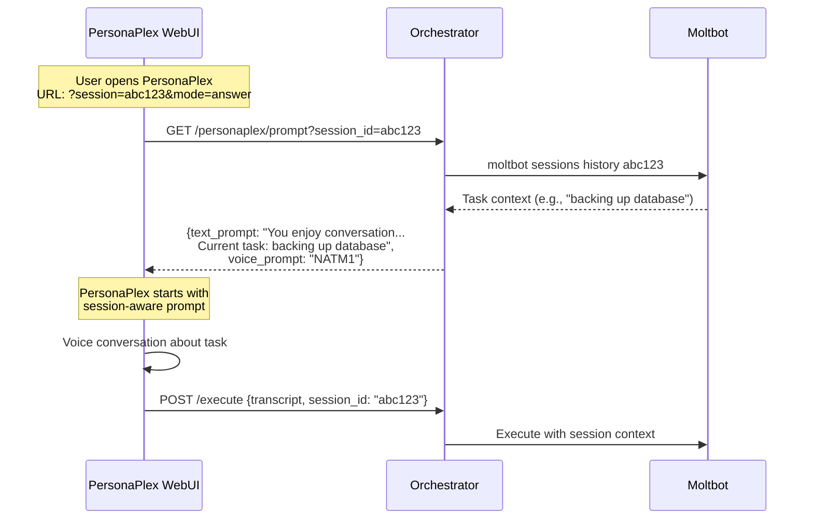

# Moltbot Integration Refactor Plan

## Objective

Simplify the Personaplex-Moltbot integration by:
1. Removing ChromaDB - use Moltbot native memory as source of truth
2. Leveraging Moltbot session tools for PersonaPlex frontend context
3. Adding error monitoring cron job
4. Creating bootstrap files for Moltbot
5. **Fully integrating NVIDIA PersonaPlex prompting and voice features**

---

## Session ID Architecture (Critical Flow)

The session ID is the key that connects PersonaPlex voice conversations to Moltbot task context:



### Session ID Sources

1. **New conversation**: Orchestrator generates UUID, returns in response
2. **WhatsApp link**: Contains `?session=<id>` from pending question
3. **Existing session**: Frontend stores and passes back for continuity

### Session ID Usage Points

| Component | How Session ID is Used |
|-----------|----------------------|
| **PersonaPlex Frontend** | Reads from URL param, passes to /personaplex/prompt, includes in /execute |
| **Orchestrator /personaplex/prompt** | Fetches Moltbot session history to build context-aware prompt |
| **Orchestrator /execute** | Associates transcript with session for continuity |
| **Orchestrator /resume** | Identifies which paused execution to resume |
| **WhatsApp Notifications** | Embeds in link: `?session=<id>&mode=answer` |

---

## New Architecture

```mermaid
flowchart TB
    subgraph PersonaPlex [PersonaPlex Server :8998]
        Voice[Voice AI - Full Duplex]
        Transcript[Transcript Array]
        Frontend[React Frontend]
    end

    subgraph Orchestrator [Orchestrator :5000 - FastAPI]
        LLM[Claude LLM - Command Extraction]
        Safety[safety.py - Validation]
        SessionAPI[/sessions API]
    end

    subgraph Moltbot [Moltbot Gateway :18789]
        Agent[moltbot agent]
        Tools[Built-in Tools]
        MoltMemory[Native Memory - MEMORY.md + memory/]
        Sessions[Session Management]
        Cron[Cron - Error Monitor]
    end

    User -->|Voice| Voice
    Voice --> Transcript
    Transcript -->|POST /execute| LLM
    LLM --> Safety
    Safety -->|moltbot agent --message| Agent
    Agent -->|system.run| Tools
    Agent <-->|Read/Write| MoltMemory
    SessionAPI -->|sessions_list, sessions_history| Sessions
    Frontend -->|GET /sessions| SessionAPI
    Cron -->|Check terminals| Agent
    Agent -->|--deliver --channel whatsapp| User
```

---

## Phase 1: Remove ChromaDB (Simplify Memory)

### Files to Delete
- `orchestrator/memory.py` - Remove entirely
- `orchestrator/memory_sync.py` - Remove entirely

### Files to Modify

#### `orchestrator/main.py`
Remove all ChromaDB imports and usage:
```python
# REMOVE these imports
from . import memory, memory_sync

# REMOVE these calls
memory.store(...)
memory.recall(...)
memory.store_execution_context(...)
memory.get_execution_context(...)
memory_sync.sync_from_moltbot(...)
memory_sync.inject_to_moltbot(...)
```

Execution state will use Moltbot sessions instead of ChromaDB.

#### `orchestrator/config.py`
Remove:
```python
CHROMADB_PATH = os.getenv("CHROMADB_PATH", "./data/chromadb")
```

Add:
```python
MOLTBOT_WORKSPACE = os.getenv("MOLTBOT_WORKSPACE", "~/clawd")
```

#### `requirements.txt`
Remove:
```
chromadb
```

#### `.env.example`
Remove:
```
CHROMADB_PATH=./data/chromadb
```

Add:
```
MOLTBOT_WORKSPACE=~/clawd
```

#### `Dockerfile`
Remove ChromaDB setup, add workspace volume:
```dockerfile
# Remove: RUN pip install chromadb
# Add volume for Moltbot workspace persistence
VOLUME ["/root/clawd"]
```

---

## Phase 2: Leverage Moltbot Session Tools

### New Endpoint: GET /sessions

Add to `orchestrator/main.py`:

```python
@app.get("/sessions")
async def get_moltbot_sessions():
    """
    Expose Moltbot session data for PersonaPlex frontend context.
    Uses moltbot sessions_list and sessions_history tools.
    """
    try:
        # Get list of sessions
        proc = await asyncio.create_subprocess_exec(
            "moltbot", "sessions", "list", "--json",
            stdout=asyncio.subprocess.PIPE,
            stderr=asyncio.subprocess.PIPE,
        )
        stdout, _ = await asyncio.wait_for(proc.communicate(), timeout=10.0)
        sessions = json.loads(stdout.decode())
        
        return {"sessions": sessions}
    except Exception as e:
        logger.exception("Failed to get Moltbot sessions")
        return {"sessions": [], "error": str(e)}


@app.get("/sessions/{session_key}/history")
async def get_session_history(session_key: str, limit: int = 50):
    """
    Get transcript history for a specific Moltbot session.
    PersonaPlex frontend can use this for context building.
    """
    try:
        proc = await asyncio.create_subprocess_exec(
            "moltbot", "sessions", "history", session_key,
            "--limit", str(limit), "--json",
            stdout=asyncio.subprocess.PIPE,
            stderr=asyncio.subprocess.PIPE,
        )
        stdout, _ = await asyncio.wait_for(proc.communicate(), timeout=10.0)
        history = json.loads(stdout.decode())
        
        return {"session_key": session_key, "history": history}
    except Exception as e:
        logger.exception("Failed to get session history for %s", session_key)
        return {"session_key": session_key, "history": [], "error": str(e)}
```

### PersonaPlex Frontend Integration

The PersonaPlex React frontend can call these endpoints to:
1. List available sessions on load
2. Fetch history for context building
3. Display session state to the user
4. **Build dynamic prompts with current task context**

Example usage in frontend:
```typescript
// useSessionContext.ts
export async function fetchSessionContext(orchestratorUrl: string) {
  const sessions = await fetch(`${orchestratorUrl}/sessions`).then(r => r.json());
  
  // Get history from most recent session
  if (sessions.sessions.length > 0) {
    const mainSession = sessions.sessions.find(s => s.key === 'main') || sessions.sessions[0];
    const history = await fetch(`${orchestratorUrl}/sessions/${mainSession.key}/history`).then(r => r.json());
    return { sessions: sessions.sessions, currentHistory: history.history };
  }
  
  return { sessions: [], currentHistory: [] };
}
```

---

## Phase 2.5: PersonaPlex Full Integration

This phase ensures we fully utilize NVIDIA PersonaPlex features: dynamic prompting, voice selection, and session-aware context.

### PersonaPlex Prompting Guide (Reference)

Per [NVIDIA PersonaPlex](https://github.com/NVIDIA/personaplex), the model supports three prompt categories:

1. **Assistant Role** (fixed):
   ```
   You are a wise and friendly teacher. Answer questions or provide advice in a clear and engaging way.
   ```

2. **Customer Service Roles** (variable):
   ```
   You work for [Company] which is a [type] and your name is [Name]. Information: [context]
   ```

3. **Casual Conversations** (flexible, recommended for our use case):
   ```
   You enjoy having a good conversation. [Optional topic/context]
   ```

### Voice Selection Configuration

PersonaPlex provides pre-packaged voice embeddings:

| Category | Voices |
|----------|--------|
| Natural (female) | NATF0, NATF1, NATF2, NATF3 |
| Natural (male) | NATM0, NATM1, NATM2, NATM3 |
| Variety (female) | VARF0, VARF1, VARF2, VARF3, VARF4 |
| Variety (male) | VARM0, VARM1, VARM2, VARM3, VARM4 |

**Recommendation**: Use `NATM1` or `NATF2` for conversational VPS admin tasks.

### New Endpoint: GET /personaplex/prompt

Add to `orchestrator/main.py`:

```python
@app.get("/personaplex/prompt")
async def get_personaplex_prompt(session_id: str | None = None):
    """
    Build a dynamic PersonaPlex text-prompt with current session context.
    The PersonaPlex frontend calls this before starting a conversation.
    
    Returns prompt formatted for PersonaPlex's casual conversation style.
    """
    base_prompt = "You enjoy having a good conversation."
    
    if not session_id:
        # No active session - general VPS admin context
        return {
            "text_prompt": f"{base_prompt} You are Kent's VPS admin assistant. Help with server tasks via natural voice conversation.",
            "voice_prompt": config.PERSONAPLEX_VOICE,
        }
    
    # Fetch session context from Moltbot
    try:
        proc = await asyncio.create_subprocess_exec(
            "moltbot", "sessions", "history", session_id,
            "--limit", "10", "--json",
            stdout=asyncio.subprocess.PIPE,
            stderr=asyncio.subprocess.PIPE,
        )
        stdout, _ = await asyncio.wait_for(proc.communicate(), timeout=10.0)
        history = json.loads(stdout.decode())
        
        # Build context summary from recent history
        if history:
            recent_context = history[-1].get("content", "")[:500]  # Last message
            task_summary = f"The current task context: {recent_context}"
        else:
            task_summary = "No specific task in progress."
        
        return {
            "text_prompt": f"{base_prompt} You are Kent's VPS admin assistant. {task_summary}",
            "voice_prompt": config.PERSONAPLEX_VOICE,
            "session_id": session_id,
        }
    except Exception as e:
        logger.exception("Failed to build PersonaPlex prompt for session %s", session_id)
        return {
            "text_prompt": f"{base_prompt} You are Kent's VPS admin assistant.",
            "voice_prompt": config.PERSONAPLEX_VOICE,
            "error": str(e),
        }


@app.get("/personaplex/prompt/question")
async def get_question_prompt(session_id: str, question: str, context: str = ""):
    """
    Build a PersonaPlex prompt specifically for answering a question from Moltbot.
    Used when user clicks WhatsApp link to answer a pending question.
    
    This prompt guides PersonaPlex to focus on getting the user's answer.
    """
    prompt = f"""You enjoy having a good conversation. You are Kent's VPS admin assistant.

You paused a server task because you need clarification. Here's what you need to ask:

Question: {question}
Context: {context}

Listen for Kent's answer, then confirm you understood. Keep the conversation focused on getting a clear answer to this question."""
    
    return {
        "text_prompt": prompt,
        "voice_prompt": config.PERSONAPLEX_VOICE,
        "session_id": session_id,
        "mode": "question",
    }
```

### Configuration Updates

Add to `orchestrator/config.py`:

```python
# PersonaPlex Voice Configuration
# Options: NATF0-3, NATM0-3 (natural), VARF0-4, VARM0-4 (variety)
PERSONAPLEX_VOICE = os.getenv("PERSONAPLEX_VOICE", "NATM1")
```

Add to `.env.example`:

```bash
# PersonaPlex Configuration
PERSONAPLEX_URL=https://your-server:8998
PERSONAPLEX_VOICE=NATM1  # Options: NATF0-3, NATM0-3, VARF0-4, VARM0-4
```

### PersonaPlex Server Launch Script

Update `scripts/start_personaplex.sh`:

```bash
#!/bin/bash
set -e

# Fetch dynamic prompt from orchestrator
PROMPT_RESPONSE=$(curl -s "http://localhost:5000/personaplex/prompt")
TEXT_PROMPT=$(echo "$PROMPT_RESPONSE" | jq -r '.text_prompt')
VOICE_PROMPT=$(echo "$PROMPT_RESPONSE" | jq -r '.voice_prompt')

# Generate SSL certs
SSL_DIR=$(mktemp -d)

# Launch PersonaPlex with configured prompts
python -m moshi.server \
    --ssl "$SSL_DIR" \
    --voice-prompt "${VOICE_PROMPT}.pt" \
    --text-prompt "$TEXT_PROMPT"
```

### PersonaPlex WebUI Session Integration

The PersonaPlex React frontend (`client/`) needs updates to:

1. **Read session from URL params**: `?session=<id>&mode=answer`
2. **Fetch prompt from orchestrator before connecting**
3. **Include session_id in transcript submissions**

#### Update: `client/src/hooks/usePersonaplexSession.ts`

```typescript
import { useState, useEffect } from 'react';

interface PersonaplexPrompt {
  text_prompt: string;
  voice_prompt: string;
  session_id?: string;
  mode?: 'conversation' | 'question';
}

export function usePersonaplexSession(orchestratorUrl: string) {
  const [prompt, setPrompt] = useState<PersonaplexPrompt | null>(null);
  const [loading, setLoading] = useState(true);
  
  useEffect(() => {
    async function fetchPrompt() {
      // Parse URL params
      const params = new URLSearchParams(window.location.search);
      const sessionId = params.get('session');
      const mode = params.get('mode');
      
      let endpoint = `${orchestratorUrl}/personaplex/prompt`;
      
      if (mode === 'answer' && sessionId) {
        // Fetch question context for answer mode
        const contextRes = await fetch(`${orchestratorUrl}/context/${sessionId}`);
        const context = await contextRes.json();
        
        if (context.current_question) {
          endpoint = `${orchestratorUrl}/personaplex/prompt/question?session_id=${sessionId}&question=${encodeURIComponent(context.current_question)}&context=${encodeURIComponent(context.question_context || '')}`;
        }
      } else if (sessionId) {
        endpoint = `${orchestratorUrl}/personaplex/prompt?session_id=${sessionId}`;
      }
      
      const res = await fetch(endpoint);
      const data = await res.json();
      setPrompt(data);
      setLoading(false);
    }
    
    fetchPrompt();
  }, [orchestratorUrl]);
  
  return { prompt, loading };
}
```

#### Update: `client/src/pages/Conversation/Conversation.tsx`

```typescript
// Add session awareness to transcript submissions
function Conversation() {
  const { prompt, loading } = usePersonaplexSession(ORCHESTRATOR_URL);
  const [transcript, setTranscript] = useState<string[]>([]);
  
  // When user clicks Execute or Submit Answer
  async function handleAction() {
    const sessionId = prompt?.session_id;
    const mode = prompt?.mode;
    
    if (mode === 'question' && sessionId) {
      // Extract answer from transcript and submit to resume endpoint
      const answer = extractAnswerFromTranscript(transcript);
      await fetch(`${ORCHESTRATOR_URL}/resume/${sessionId}`, {
        method: 'POST',
        headers: { 'Content-Type': 'application/json' },
        body: JSON.stringify({ answer }),
      });
    } else {
      // Normal execution flow with session_id attached
      await fetch(`${ORCHESTRATOR_URL}/execute`, {
        method: 'POST',
        headers: { 'Content-Type': 'application/json' },
        body: JSON.stringify({ 
          transcript,
          session_id: sessionId,  // Pass session_id for context continuity
        }),
      });
    }
  }
  
  // ... rest of component
}
```

### Full-Duplex Conversation Features

PersonaPlex supports full-duplex features that improve natural conversation:

1. **User Interruption**: User can interrupt while assistant is speaking
2. **Backchannel Responses**: "uh-huh", "I see", "okay" during user speech
3. **Pause Handling**: Natural handling of user pauses

These work automatically with the casual conversation prompt:
```
You enjoy having a good conversation.
```

For VPS admin tasks, the assistant should:
- Allow interruption during long status reports
- Use backchannels to confirm understanding ("Got it", "Okay")
- Wait appropriately when user is thinking about commands

---

## Phase 3: Error Monitoring Cron

### Moltbot Cron Configuration

Add to Moltbot config (`~/.clawdbot/moltbot.json`):

```json
{
  "cron": {
    "jobs": [
      {
        "id": "terminal-error-monitor",
        "schedule": "*/15 * * * *",
        "task": "Check all terminal outputs for errors, warnings, or issues. If any critical errors are found, summarize them and send a WhatsApp notification to the admin. Focus on: 1) Service crashes, 2) Out of memory errors, 3) Disk space issues, 4) Failed commands, 5) Network connectivity problems. Only report NEW issues not previously reported today.",
        "enabled": true
      }
    ]
  }
}
```

### Alternative: Create Cron via Orchestrator Startup

Add to `orchestrator/main.py` startup:

```python
async def setup_error_monitor_cron():
    """Configure Moltbot cron job for terminal error monitoring."""
    try:
        cron_config = {
            "id": "terminal-error-monitor",
            "schedule": "*/15 * * * *",  # Every 15 minutes
            "task": """Check terminal outputs and system logs for errors:
1. Run 'dmesg | tail -50' for kernel messages
2. Check 'journalctl -p err -n 20' for recent errors
3. Check 'df -h' for disk space issues (alert if >90%)
4. Check 'free -h' for memory issues
5. Look for any crashed services with 'systemctl --failed'

If critical issues found, send WhatsApp notification with summary.
Only report NEW issues not already in today's memory log.""",
            "enabled": True
        }
        
        # Add cron job via moltbot CLI
        proc = await asyncio.create_subprocess_exec(
            "moltbot", "cron", "add",
            "--id", cron_config["id"],
            "--schedule", cron_config["schedule"],
            "--task", cron_config["task"],
            stdout=asyncio.subprocess.PIPE,
            stderr=asyncio.subprocess.PIPE,
        )
        await proc.communicate()
        logger.info("Error monitor cron job configured")
    except Exception as e:
        logger.warning("Could not setup error monitor cron: %s", e)


@asynccontextmanager
async def lifespan(app: FastAPI):
    """Manage app startup and shutdown."""
    # Startup
    cleanup_task = asyncio.create_task(cleanup_expired_pending())
    await setup_error_monitor_cron()  # NEW: Setup cron on startup
    yield
    # Shutdown
    cleanup_task.cancel()
```

---

## Phase 4: Bootstrap Files

Create the following files in the repository under `moltbot/` directory. These will be copied to the Moltbot workspace on deployment.

### Directory Structure

```
kent_clawd_personaplex/
  moltbot/
    AGENTS.md      # Operating instructions
    SOUL.md        # Persona and tone
    TOOLS.md       # Tool usage guidance
    USER.md        # User profile
    MEMORY.md      # Initial curated memory
    skills/
      vps-admin.md # Custom skill for VPS administration
```

### `moltbot/AGENTS.md`

```markdown
# Kent's VPS Admin Agent

You are a voice-controlled VPS administration assistant for Kent. You help manage servers through natural conversation.

## Core Responsibilities

1. **Command Execution**: Execute server commands when requested via voice
2. **Status Monitoring**: Check system health, disk space, memory, services
3. **Error Detection**: Monitor for and report critical errors
4. **Learning**: Remember Kent's preferences and common operations

## Operating Rules

1. Always confirm destructive operations before executing (rm, stop, kill, etc.)
2. Use NEED_INPUT signal when clarification is needed
3. Store important learnings in memory/YYYY-MM-DD.md
4. Send WhatsApp notifications for:
   - Questions requiring user input
   - Completed long-running tasks
   - Critical errors detected

## Common Operations

- Check disk: `df -h`
- Check memory: `free -h`
- List processes: `ps aux | head -20`
- Service status: `systemctl status <service>`
- Docker containers: `docker ps`
- Recent logs: `journalctl -n 50`

## Safety Guidelines

- Never run commands with `rm -rf /` patterns
- Always use `-i` flag for interactive deletions when possible
- Confirm before stopping production services
- Log all destructive operations to memory
```

### `moltbot/SOUL.md`

```markdown
# Soul

You are Kent's trusted VPS admin assistant. You communicate clearly and concisely, optimized for voice interaction.

## Personality

- Professional but friendly
- Concise responses (voice-optimized)
- Proactive about potential issues
- Patient when clarifying complex requests

## Communication Style

- Short sentences work better for voice
- Summarize results, don't dump raw output
- Ask clarifying questions when commands are ambiguous
- Confirm understanding before destructive operations

## Boundaries

- Only execute commands on authorized servers
- Never expose sensitive credentials in responses
- Respect rate limits and system resources
- Escalate to WhatsApp for anything requiring immediate attention
```

### `moltbot/TOOLS.md`

```markdown
# Tools Usage Guide

## exec / system.run

Primary tool for command execution. Use for:
- System status checks (df, free, ps, top)
- Service management (systemctl)
- Docker operations
- File operations (ls, cat, head, tail)

## memory_search / memory_get

Search past interactions and learned patterns. Use to:
- Recall user preferences
- Find similar past commands
- Avoid asking questions already answered

## message

For WhatsApp notifications:
- Questions requiring user input
- Task completion summaries
- Critical error alerts

## cron

Scheduled tasks:
- Error monitoring every 15 minutes
- Daily health check summaries

## sessions_*

For context management:
- sessions_list: See active sessions
- sessions_history: Get conversation history
- session_status: Check current state
```

### `moltbot/USER.md`

```markdown
# User: Kent

## Preferences

- Prefers concise summaries over raw output
- Likes proactive notifications for issues
- Uses WhatsApp for async communication
- Values confirmation before destructive ops

## Common Tasks

- Checking server health
- Docker container management
- Log analysis
- Service restarts

## Working Hours

- Typically available 9am-6pm
- Send WhatsApp for urgent issues anytime
- Batch non-urgent notifications
```

### `moltbot/MEMORY.md`

```markdown
# Curated Memory

## Server Configuration

- Primary admin server: this container
- Notification channel: WhatsApp
- PersonaPlex voice interface on port 8998
- Orchestrator API on port 5000

## Learned Preferences

- Kent prefers `docker ps --format "table {{.Names}}\t{{.Status}}"` for container listing
- When asked about "the database", default to production PostgreSQL
- Backup operations should always be confirmed first

## Common Issues & Solutions

- If PersonaPlex crashes, restart with: `python -m moshi.server --ssl "$SSL_DIR"`
- If disk >90%, first check docker: `docker system df` and `docker system prune`
```

### `moltbot/skills/vps-admin.md`

```markdown
# VPS Admin Skill

## Purpose

Specialized guidance for VPS administration via voice commands.

## Capabilities

### System Health
- Disk space monitoring with alerts at 80% and 90%
- Memory usage tracking
- CPU load averages
- Service status checks

### Docker Management
- Container lifecycle (start, stop, restart)
- Log viewing with smart truncation
- Image and volume cleanup
- Compose operations

### Log Analysis
- Extract errors from journalctl
- Parse application logs
- Identify patterns in failures

## Response Format

For voice responses, always:
1. Start with the most important information
2. Summarize numbers (e.g., "disk is 78% full" not raw df output)
3. Offer next steps if issues found
4. Keep total response under 30 seconds of speech
```

---

## Phase 5: Deployment Updates

### `scripts/start.sh` Updates

Add workspace setup:

```bash
#!/bin/bash
set -e

# Setup Moltbot workspace if not exists
MOLTBOT_WORKSPACE="${MOLTBOT_WORKSPACE:-$HOME/clawd}"
if [ ! -d "$MOLTBOT_WORKSPACE" ]; then
    mkdir -p "$MOLTBOT_WORKSPACE"
    mkdir -p "$MOLTBOT_WORKSPACE/memory"
    mkdir -p "$MOLTBOT_WORKSPACE/skills"
    
    # Copy bootstrap files from repo
    cp /app/moltbot/AGENTS.md "$MOLTBOT_WORKSPACE/"
    cp /app/moltbot/SOUL.md "$MOLTBOT_WORKSPACE/"
    cp /app/moltbot/TOOLS.md "$MOLTBOT_WORKSPACE/"
    cp /app/moltbot/USER.md "$MOLTBOT_WORKSPACE/"
    cp /app/moltbot/MEMORY.md "$MOLTBOT_WORKSPACE/"
    cp /app/moltbot/skills/*.md "$MOLTBOT_WORKSPACE/skills/"
    
    echo "Moltbot workspace initialized at $MOLTBOT_WORKSPACE"
fi

# Rest of startup script...
```

### `Dockerfile` Updates

```dockerfile
# Remove ChromaDB
# RUN pip install chromadb  # REMOVED

# Copy Moltbot bootstrap files
COPY moltbot/ /app/moltbot/

# Create workspace volume
VOLUME ["/root/clawd"]
```

---

## Implementation Order

### Step 1: Create Bootstrap Files
1. Create `moltbot/` directory structure
2. Add AGENTS.md, SOUL.md, TOOLS.md, USER.md, MEMORY.md
3. Add skills/vps-admin.md

### Step 2: Remove ChromaDB
1. Delete `orchestrator/memory.py`
2. Delete `orchestrator/memory_sync.py`
3. Update `orchestrator/main.py` to remove memory imports/calls
4. Update `orchestrator/config.py`
5. Update `requirements.txt`
6. Update `.env.example`

### Step 3: Add Session API
1. Add GET /sessions endpoint
2. Add GET /sessions/{key}/history endpoint
3. Test with `curl localhost:5000/sessions`

### Step 4: PersonaPlex Integration (NEW)
1. Add `PERSONAPLEX_VOICE` to config.py
2. Add GET /personaplex/prompt endpoint
3. Add GET /personaplex/prompt/question endpoint
4. Create `scripts/start_personaplex.sh` with dynamic prompt fetching
5. Update PersonaPlex client hooks for session awareness
6. Test prompt generation with `curl localhost:5000/personaplex/prompt?session_id=test`

### Step 5: Configure Cron
1. Add `setup_error_monitor_cron()` function
2. Call from lifespan startup
3. Verify cron with `moltbot cron list`

### Step 6: Update Deployment
1. Update `scripts/start.sh` with workspace setup
2. Update `Dockerfile`
3. Create `scripts/start_personaplex.sh`
4. Test full deployment with PersonaPlex + Orchestrator

---

## Verification Checklist

### Core Infrastructure
- [ ] ChromaDB completely removed (no imports, no config, no requirements)
- [ ] Moltbot workspace initializes with bootstrap files on first run
- [ ] `/sessions` endpoint returns Moltbot session list
- [ ] `/sessions/{key}/history` returns transcript history
- [ ] Error monitor cron runs every 15 minutes
- [ ] WhatsApp notifications work for cron-detected errors

### PersonaPlex Integration
- [ ] `/personaplex/prompt` returns dynamic text-prompt with session context
- [ ] `/personaplex/prompt/question` returns focused question prompt for answer mode
- [ ] PersonaPlex server launches with correct `--voice-prompt` (NATM1 default)
- [ ] PersonaPlex server uses dynamic `--text-prompt` from orchestrator
- [ ] Frontend reads `?session=<id>` URL param and fetches appropriate prompt
- [ ] Frontend reads `?mode=answer` and shows question-focused UI
- [ ] Session ID flows from frontend → orchestrator in /execute calls
- [ ] Answer submission via /resume/{session_id} works from PersonaPlex UI
- [ ] Full-duplex features work (user can interrupt, natural pauses handled)

### End-to-End Flow
- [ ] Voice command → Orchestrator → Moltbot execution works
- [ ] NEED_INPUT signal → WhatsApp notification with PersonaPlex link
- [ ] Click link → PersonaPlex loads with question context → Answer → Resume
- [ ] Task completion → WhatsApp notification with summary
