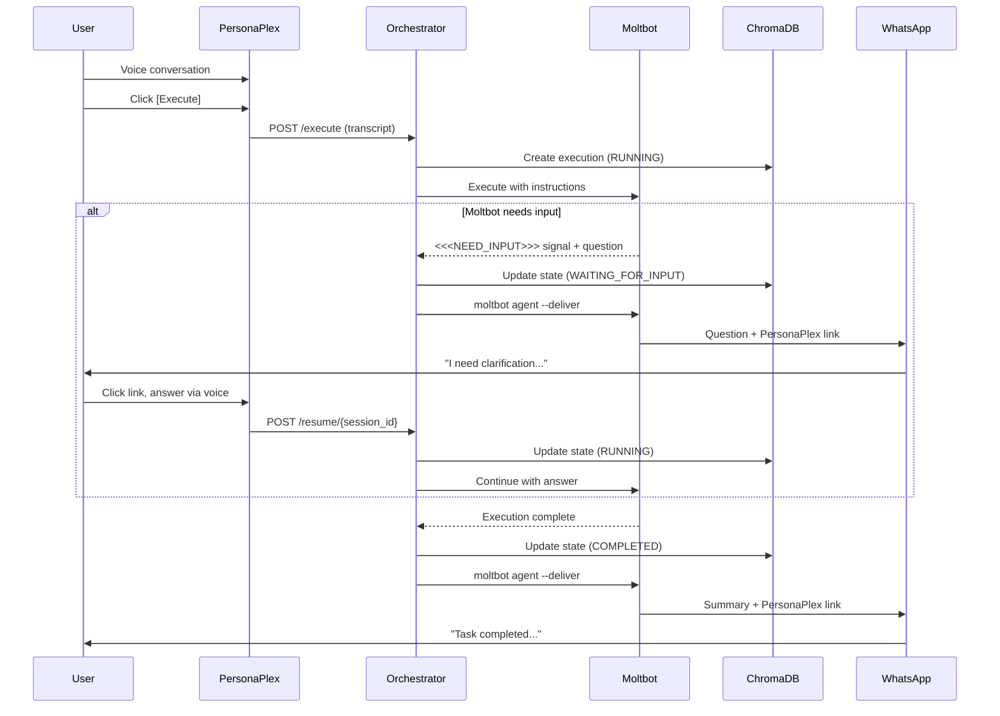
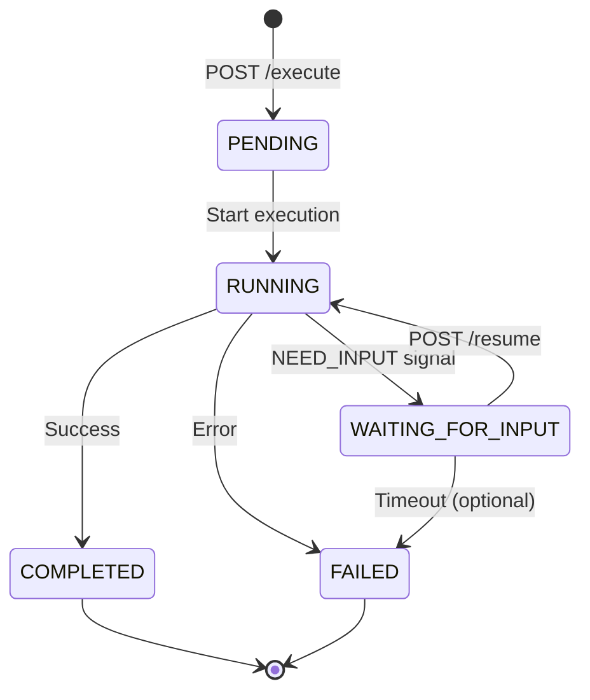
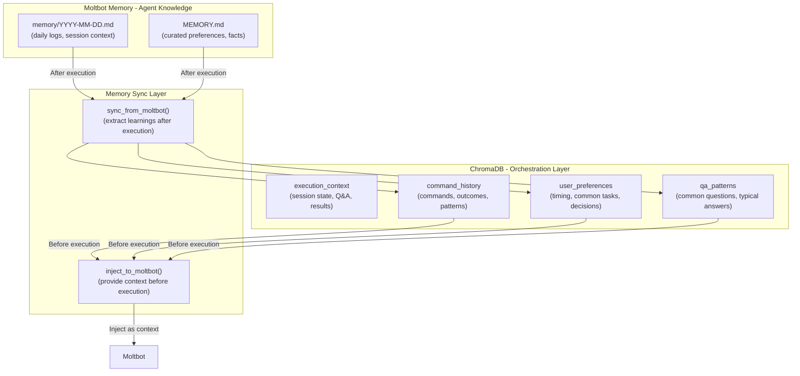
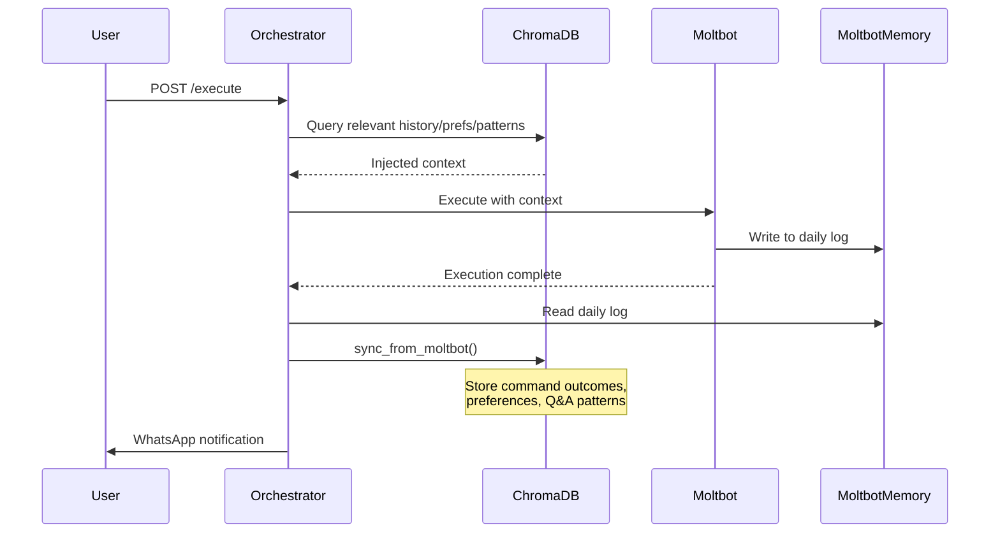

# Two-Way PersonaPlex Communication

## Architecture Overview

### Execution Flow with Human-in-the-Loop



### Execution State Machine



## Key Components

### 1. Execution State Management (`orchestrator/execution.py`)

New module to track execution state:

```python
from enum import Enum
from dataclasses import dataclass, field
from datetime import datetime, timezone
from typing import Optional
import uuid

def _utcnow() -> datetime:
    return datetime.now(timezone.utc)

class ExecutionState(Enum):
    PENDING = "pending"
    RUNNING = "running"
    WAITING_FOR_INPUT = "waiting_for_input"
    COMPLETED = "completed"
    FAILED = "failed"

@dataclass
class ExecutionContext:
    session_id: str = field(default_factory=lambda: str(uuid.uuid4()))
    state: ExecutionState = ExecutionState.PENDING
    transcript: list[str] = field(default_factory=list)
    commands: list[str] = field(default_factory=list)
    results: list[dict] = field(default_factory=list)
    current_question: Optional[str] = None
    question_context: Optional[str] = None  # What Moltbot was doing when it asked
    answers: list[dict] = field(default_factory=list)  # History of Q&A
    topics: list[str] = field(default_factory=list)
    error_message: Optional[str] = None  # Populated on FAILED state
    created_at: datetime = field(default_factory=_utcnow)
    updated_at: datetime = field(default_factory=_utcnow)
```

### 2. Background Execution Model (`orchestrator/main.py`)

The existing `run_moltbot()` uses `asyncio.create_subprocess_exec`. The new long-running
execution extends this with `asyncio.create_task` for background work and `asyncio.Event`
for pause/resume signaling. No threads — pure asyncio.

```python
import asyncio
from .execution import ExecutionState, ExecutionContext

# In-memory execution registry (session_id -> running context + event)
_executions: dict[str, dict] = {}  # {"ctx": ExecutionContext, "event": asyncio.Event}

async def _run_execution(ctx: ExecutionContext) -> None:
    """Background task: run Moltbot, detect NEED_INPUT, handle pause/resume."""
    try:
        ctx.state = ExecutionState.RUNNING
        memory.store_execution_context(ctx)

        instruction = llm.generate_moltbot_instruction(
            ctx.commands, ctx.answers, ctx.session_id
        )
        output = await run_moltbot_long(instruction, ctx.session_id)
        parsed = llm.parse_moltbot_output(output)

        while parsed["status"] == "needs_input":
            # Pause: store question, notify user, wait for resume
            ctx.state = ExecutionState.WAITING_FOR_INPUT
            ctx.current_question = parsed["question"]
            ctx.question_context = parsed.get("context")
            ctx.updated_at = _utcnow()
            memory.store_execution_context(ctx)

            notify.send_question_notification(
                config.WHATSAPP_PHONE, parsed["question"],
                parsed.get("context", ""), config.PERSONAPLEX_URL, ctx.session_id
            )

            # Block until POST /resume sets the event
            event = _executions[ctx.session_id]["event"]
            event.clear()
            await asyncio.wait_for(event.wait(), timeout=config.EXECUTION_TIMEOUT_MINUTES * 60)

            # Resume with the answer
            ctx.state = ExecutionState.RUNNING
            ctx.current_question = None
            ctx.updated_at = _utcnow()
            memory.store_execution_context(ctx)

            instruction = llm.generate_moltbot_instruction(
                ctx.commands, ctx.answers, ctx.session_id
            )
            output = await run_moltbot_long(instruction, ctx.session_id)
            parsed = llm.parse_moltbot_output(output)

        # Completed
        ctx.state = ExecutionState.COMPLETED
        ctx.results.append({"output": parsed["output"]})
        ctx.updated_at = _utcnow()
        memory.store_execution_context(ctx)

        if config.NOTIFY_ON_COMPLETE:
            notify.send_completion_notification(
                config.WHATSAPP_PHONE, parsed["output"],
                config.PERSONAPLEX_URL, ctx.session_id
            )

    except asyncio.TimeoutError:
        ctx.state = ExecutionState.FAILED
        ctx.error_message = f"Timed out waiting for user input ({config.EXECUTION_TIMEOUT_MINUTES}min)"
        ctx.updated_at = _utcnow()
        memory.store_execution_context(ctx)
    except Exception as e:
        ctx.state = ExecutionState.FAILED
        ctx.error_message = str(e)
        ctx.updated_at = _utcnow()
        memory.store_execution_context(ctx)
        logger.exception("Execution %s failed", ctx.session_id)
    finally:
        # Cleanup: remove from in-memory registry after a delay for polling
        await asyncio.sleep(300)  # Keep for 5min after completion
        _executions.pop(ctx.session_id, None)
```

### 3. Moltbot Invocation (`orchestrator/main.py`)

Extends the existing `run_moltbot()` pattern for long-running executions with higher timeout:

```python
async def run_moltbot_long(instruction: str, session_id: str) -> str:
    """Run Moltbot with a multi-command instruction. Longer timeout than single commands."""
    try:
        proc = await asyncio.create_subprocess_exec(
            "moltbot", "agent", "--message", instruction,
            stdout=asyncio.subprocess.PIPE,
            stderr=asyncio.subprocess.PIPE,
        )
        stdout, stderr = await asyncio.wait_for(
            proc.communicate(),
            timeout=config.EXECUTION_TIMEOUT_MINUTES * 60,
        )
        if proc.returncode != 0:
            raise RuntimeError(f"Moltbot exited {proc.returncode}: {stderr.decode(errors='replace')}")
        return stdout.decode(errors="replace")
    except FileNotFoundError:
        raise RuntimeError("Moltbot service is unavailable")
    except asyncio.TimeoutError:
        proc.kill()
        raise RuntimeError(f"Moltbot timed out after {config.EXECUTION_TIMEOUT_MINUTES}min")
```

### 4. Orchestrator Endpoints (`orchestrator/main.py`)

**`POST /execute`** - Start execution
```python
class ExecutePayload(BaseModel):
    transcript: str
    commands: list[str]

@app.post("/execute")
async def start_execution(payload: ExecutePayload):
    ctx = ExecutionContext(
        transcript=[payload.transcript],
        commands=payload.commands,
    )
    event = asyncio.Event()
    _executions[ctx.session_id] = {"ctx": ctx, "event": event}
    asyncio.create_task(_run_execution(ctx))
    return {"session_id": ctx.session_id, "state": ctx.state.value}
```

**`GET /context/{session_id}`** - Get current context (also serves as status endpoint)
- Return full ExecutionContext (state, results, current question if any)
- Used by PersonaPlex UI when user returns via link, and for status polling

**`POST /resume/{session_id}`** - Resume paused execution
```python
class ResumePayload(BaseModel):
    answer: str

@app.post("/resume/{session_id}")
async def resume_execution(session_id: str, payload: ResumePayload):
    entry = _executions.get(session_id)
    if not entry:
        return {"error": "Session not found"}, 404
    ctx = entry["ctx"]
    if ctx.state != ExecutionState.WAITING_FOR_INPUT:
        return {"error": f"Session is {ctx.state.value}, not waiting for input"}, 409

    ctx.answers.append({
        "question": ctx.current_question,
        "answer": payload.answer,
    })
    # Signal the background task to continue
    entry["event"].set()
    return {"session_id": session_id, "state": "resuming"}
```

### 3. Moltbot Instructions with NEED_INPUT Signal (`orchestrator/llm.py`)

Instruct Moltbot to signal when it needs human input:

```python
MOLTBOT_INSTRUCTION_TEMPLATE = """
Execute the following plan on the server. If at any point you need clarification,
additional information, or a decision from the user, STOP and output exactly this format:

<<<NEED_INPUT>>>
Your question here
<<<CONTEXT>>>
Brief description of what you were doing and why you need input
<<<END_INPUT>>>

Do NOT guess or assume. Wait for the user's response before continuing.

Plan to execute:
{commands}

Previous answers from user (if any):
{previous_answers}
"""

def generate_moltbot_instruction(
    commands: list[str],
    answers: list[dict],
    session_id: str,
) -> str:
    """Generate instruction for Moltbot with NEED_INPUT signal and injected context."""
    prev = "\n".join([f"Q: {a['question']}\nA: {a['answer']}" for a in answers]) or "None"
    return MOLTBOT_INSTRUCTION_TEMPLATE.format(
        commands="\n".join(commands),
        previous_answers=prev,
    )
```

### 4. Question Detection (`orchestrator/llm.py`)

Parse Moltbot output for NEED_INPUT signals:

```python
import re

# Use a structured delimiter that won't appear in natural Moltbot output.
# The triple-bracket format avoids false positives from conversational text.
NEED_INPUT_PATTERN = re.compile(
    r'<<<NEED_INPUT>>>\s*(.+?)\s*<<<CONTEXT>>>\s*(.+?)\s*<<<END_INPUT>>>',
    re.DOTALL,
)

def parse_moltbot_output(output: str) -> dict:
    """Parse Moltbot output for completion or NEED_INPUT signal."""
    match = NEED_INPUT_PATTERN.search(output)
    if match:
        return {
            "status": "needs_input",
            "question": match.group(1).strip(),
            "context": match.group(2).strip(),
        }
    return {
        "status": "complete",
        "output": output,
    }
```

> **Note**: The corresponding instruction template (section 5) uses matching
> `<<<NEED_INPUT>>>` / `<<<CONTEXT>>>` / `<<<END_INPUT>>>` delimiters.

### 5. Context Storage (`orchestrator/memory.py`)

Extend ChromaDB for execution context:

```python
def store_execution_context(ctx: ExecutionContext) -> None:
    """Store or update execution context."""

def get_execution_context(session_id: str) -> ExecutionContext | None:
    """Retrieve execution context by session ID."""

def update_execution_state(session_id: str, state: ExecutionState, **updates) -> None:
    """Update execution state and any additional fields."""
```

### 6. WhatsApp Notification (`orchestrator/notify.py`)

Handle both question and completion notifications:

```python
import subprocess

def send_question_notification(
    phone: str,
    question: str,
    context: str,
    personaplex_url: str,
    session_id: str
) -> bool:
    """Send WhatsApp notification when Moltbot needs input."""
    message = f"I need your input:\n\n{question}\n\nContext: {context}\n\nAnswer here: {personaplex_url}?session={session_id}&mode=answer"
    return _send_whatsapp(phone, message)

def send_completion_notification(
    phone: str,
    summary: str,
    personaplex_url: str,
    session_id: str
) -> bool:
    """Send WhatsApp notification when execution completes."""
    message = f"Task completed:\n\n{summary}\n\nReview here: {personaplex_url}?session={session_id}"
    return _send_whatsapp(phone, message)

def _send_whatsapp(phone: str, message: str) -> bool:
    result = subprocess.run([
        "moltbot", "agent",
        "--message", message,
        "--deliver",
        "--channel", "whatsapp",
        "--to", phone
    ], capture_output=True, timeout=30)
    return result.returncode == 0
```

### 7. PersonaPlex UI Changes (`client/`)

**URL Parameters**
- `?session=<id>` - Load context for this session
- `?mode=answer` - Show answer input mode (for questions)

**Context Display Component**
- If `state=waiting_for_input`: Show the question prominently, focus on answering
- If `state=completed`: Show summary and results
- If `state=running`: Show progress indicator

**Answer Submission**
- Extract answer from voice conversation transcript
- POST to `/resume/{session_id}` with the answer
- Show confirmation that execution will continue

```typescript
// useExecutionContext.ts
export function useExecutionContext(sessionId: string | null) {
  // Fetch context including state, question, results
  // Return: { state, transcript, commands, results, currentQuestion, topics }
}

// SubmitAnswer component
export function SubmitAnswer({ sessionId, transcript, onSubmit }) {
  // Extract answer from latest transcript entries
  // POST to /resume/{session_id}
}
```

### 8. Configuration (`orchestrator/config.py`)

```python
WHATSAPP_PHONE = os.getenv("WHATSAPP_PHONE")  # User's phone (E.164)
PERSONAPLEX_URL = os.getenv("PERSONAPLEX_URL", "https://your-deployment.salad.cloud:8998")
NOTIFY_ON_COMPLETE = os.getenv("NOTIFY_ON_COMPLETE", "true").lower() == "true"
NOTIFY_ON_QUESTION = os.getenv("NOTIFY_ON_QUESTION", "true").lower() == "true"
EXECUTION_TIMEOUT_MINUTES = int(os.getenv("EXECUTION_TIMEOUT_MINUTES", "60"))
```

### 9. Moltbot WhatsApp Setup

Moltbot needs WhatsApp configured before this works:

```bash
# One-time setup on the VPS
moltbot channels login  # Scan QR with WhatsApp Linked Devices

# Config in ~/.clawdbot/moltbot.json
{
  "channels": {
    "whatsapp": {
      "dmPolicy": "allowlist",
      "allowFrom": ["+15551234567"]  # Your phone
    }
  }
}
```

## Execution Flow (Human-in-the-Loop)

### Happy Path (No Questions)

1. **User has voice conversation** with PersonaPlex about server tasks
2. **User presses [Execute Plan]** button
3. **Orchestrator creates ExecutionContext** (state=PENDING, generates session_id)
4. **Orchestrator extracts commands** from transcript via LLM
5. **Commands validated** and sent to Moltbot with NEED_INPUT instructions
6. **Moltbot executes** without needing input
7. **On completion**, orchestrator:
   - Updates state to COMPLETED
   - Stores results in ChromaDB
   - Generates topic points via LLM
   - Sends WhatsApp completion notification

8. **User receives WhatsApp message**:
   ```
   Task completed: Checked disk space and memory usage.

   Results: 45GB free, 8GB RAM available

   Review here: https://your-server:8998?session=abc123
   ```

### Path with Questions (Human-in-the-Loop)

1. **Steps 1-5 same as above**
2. **Moltbot encounters uncertainty** and outputs:
   ```
   <<<NEED_INPUT>>>
   Which database should I back up - production or staging?
   <<<CONTEXT>>>
   Found two PostgreSQL instances. The plan said "back up the database" but didn't specify which.
   <<<END_INPUT>>>
   ```

3. **Orchestrator detects NEED_INPUT**:
   - Updates state to WAITING_FOR_INPUT
   - Stores question and context
   - Sends WhatsApp question notification

4. **User receives WhatsApp message**:
   ```
   I need your input:

   Which database should I back up - production or staging?

   Context: Found two PostgreSQL instances. The plan said "back up the database" but didn't specify which.

   Answer here: https://your-server:8998?session=abc123&mode=answer
   ```

5. **User clicks link** → PersonaPlex UI loads with question displayed
6. **User answers via voice**: "Back up the production database"
7. **User presses [Submit Answer]** → Extracts answer from transcript
8. **POST /resume/{session_id}** with answer
9. **Orchestrator resumes**:
   - Stores answer in context history
   - Updates state to RUNNING
   - Continues Moltbot execution with answer injected

10. **Repeat steps 2-9** if more questions arise
11. **On final completion** → Send completion notification (same as happy path)

## File Changes Summary

| File | Change |
|------|--------|
| `orchestrator/config.py` | Add WHATSAPP_PHONE, PERSONAPLEX_URL, NOTIFY_ON_COMPLETE, NOTIFY_ON_QUESTION |
| `orchestrator/execution.py` | New file - ExecutionState enum, ExecutionContext dataclass |
| `orchestrator/memory.py` | Add store/get/update execution context functions |
| `orchestrator/notify.py` | New file - send_question_notification, send_completion_notification |
| `orchestrator/main.py` | Add /execute, /context/{id}, /resume/{id}, /status/{id} endpoints |
| `orchestrator/llm.py` | Add generate_moltbot_instruction, parse_moltbot_output functions |
| `.env.example` | Add WHATSAPP_PHONE, PERSONAPLEX_URL, EXECUTION_TIMEOUT_MINUTES |
| `client/src/hooks/useExecutionContext.ts` | New hook for context fetching |
| `client/src/pages/Conversation/Conversation.tsx` | Handle question/completion modes based on state |
| `client/src/components/SubmitAnswer/` | New component for answer extraction and submission |

## Example WhatsApp Messages

**Question Notification:**
```
I need your input:

Which database should I back up - production or staging?

Context: Found two PostgreSQL instances. The plan said "back up the database" but didn't specify which.

Answer here: https://your-server:8998?session=abc123&mode=answer
```

**Completion Notification:**
```
Task completed: Database backup and disk cleanup

Summary:
- Backed up production PostgreSQL (2.3GB)
- Freed 15GB disk space from old logs
- Current disk usage: 45% (was 78%)

Review details: https://your-server:8998?session=abc123
```

## Prerequisites

- Moltbot WhatsApp channel configured and logged in (`moltbot channels login`)
- User phone number in allowlist
- PersonaPlex accessible via public URL (for the deep-link)
- Background execution capability (threading or async) in orchestrator

---

## Dual Memory Architecture

### Overview

The system uses two complementary memory systems that sync key learnings between them:



### Memory Responsibilities

| Memory System | Purpose | Examples |
|--------------|---------|----------|
| **Moltbot Daily Logs** | Session-specific context, today's actions | "Ran backup at 2pm", "User mentioned staging server issues" |
| **Moltbot MEMORY.md** | Agent's curated long-term knowledge | "User prefers backups at night", "Production DB is on port 5432" |
| **ChromaDB execution_context** | Current execution state (short-term) | Session ID, state, current question, results |
| **ChromaDB command_history** | Historical command patterns | "df -h runs 3x/week", "docker prune usually follows disk warning" |
| **ChromaDB user_preferences** | Aggregated user patterns | "Prefers verbose output", "Usually chooses production over staging" |
| **ChromaDB qa_patterns** | Common Q&A for faster resolution | "When asked about DB, user usually means production PostgreSQL" |

### Memory Sync Module (`orchestrator/memory_sync.py`)

```python
import json
from datetime import datetime, timedelta
from typing import Optional
from .memory import get_chromadb_client

# ChromaDB collections for long-term memory
COLLECTIONS = {
    "command_history": "Commands executed with outcomes and timestamps",
    "user_preferences": "Learned user preferences and patterns",
    "qa_patterns": "Question-answer patterns for faster resolution",
}

def sync_from_moltbot(ctx: "ExecutionContext") -> dict:
    """
    After execution completes, extract learnings from the ExecutionContext
    (which already has all commands, results, and Q&A) and store patterns
    in ChromaDB. No need to parse Moltbot log files — the orchestrator
    already captured everything during execution.

    Returns: dict of what was synced
    """
    from .execution import ExecutionContext
    synced = {"commands": 0, "qa_patterns": 0}

    # 1. Store command outcomes from the execution results
    for i, cmd in enumerate(ctx.commands):
        result = ctx.results[i] if i < len(ctx.results) else {}
        store_command_outcome(
            command=cmd,
            outcome=result.get("output", "no output"),
            success=ctx.state.value == "completed",
            duration_seconds=0.0,  # TODO: track per-command timing
            session_id=ctx.session_id,
        )
        synced["commands"] += 1

    # 2. Store Q&A patterns from answers collected during execution
    for answer_record in ctx.answers:
        store_qa_pattern(
            question=answer_record["question"],
            answer=answer_record["answer"],
            context=f"Commands: {', '.join(ctx.commands[:3])}",
            session_id=ctx.session_id,
        )
        synced["qa_patterns"] += 1

    return synced


def inject_to_moltbot(session_id: str, commands: list[str]) -> str:
    """
    Before execution, query ChromaDB for relevant context
    and format it for injection into Moltbot's instructions.
    
    Returns: formatted context string to include in Moltbot prompt
    """
    context_parts = []
    client = get_chromadb_client()
    
    # 1. Query command_history for similar past commands
    cmd_collection = client.get_collection("command_history")
    similar_cmds = cmd_collection.query(
        query_texts=commands,
        n_results=5
    )
    if similar_cmds["documents"]:
        context_parts.append("## Relevant Command History")
        for doc in similar_cmds["documents"][0]:
            context_parts.append(f"- {doc}")
    
    # 2. Query user_preferences for relevant patterns
    pref_collection = client.get_collection("user_preferences")
    prefs = pref_collection.query(
        query_texts=commands,
        n_results=3
    )
    if prefs["documents"]:
        context_parts.append("\n## User Preferences")
        for doc in prefs["documents"][0]:
            context_parts.append(f"- {doc}")
    
    # 3. Query qa_patterns for anticipating questions
    qa_collection = client.get_collection("qa_patterns")
    qa = qa_collection.query(
        query_texts=commands,
        n_results=3
    )
    if qa["documents"]:
        context_parts.append("\n## Common Q&A Patterns")
        context_parts.append("(Use these to avoid asking if context is clear)")
        for doc in qa["documents"][0]:
            context_parts.append(f"- {doc}")
    
    return "\n".join(context_parts) if context_parts else ""


def store_command_outcome(
    command: str,
    outcome: str,
    success: bool,
    duration_seconds: float,
    session_id: str
) -> None:
    """Store a command execution outcome for pattern learning."""
    client = get_chromadb_client()
    collection = client.get_or_create_collection("command_history")
    
    doc = f"Command: {command} | Outcome: {outcome} | Success: {success} | Duration: {duration_seconds}s"
    metadata = {
        "command": command,
        "success": success,
        "duration": duration_seconds,
        "session_id": session_id,
        "timestamp": datetime.utcnow().isoformat(),
    }
    
    collection.add(
        documents=[doc],
        metadatas=[metadata],
        ids=[f"{session_id}_{hash(command)}"]
    )


def store_user_preference(
    preference_type: str,
    value: str,
    context: str,
    session_id: str
) -> None:
    """Store a learned user preference."""
    client = get_chromadb_client()
    collection = client.get_or_create_collection("user_preferences")
    
    doc = f"{preference_type}: {value} (learned from: {context})"
    metadata = {
        "type": preference_type,
        "value": value,
        "session_id": session_id,
        "timestamp": datetime.utcnow().isoformat(),
    }
    
    collection.add(
        documents=[doc],
        metadatas=[metadata],
        ids=[f"pref_{preference_type}_{hash(value)}"]
    )


def store_qa_pattern(
    question: str,
    answer: str,
    context: str,
    session_id: str
) -> None:
    """Store a Q&A pattern for future reference."""
    client = get_chromadb_client()
    collection = client.get_or_create_collection("qa_patterns")
    
    doc = f"Q: {question} | A: {answer} | Context: {context}"
    metadata = {
        "question": question,
        "answer": answer,
        "session_id": session_id,
        "timestamp": datetime.utcnow().isoformat(),
    }
    
    collection.add(
        documents=[doc],
        metadatas=[metadata],
        ids=[f"qa_{session_id}_{hash(question)}"]
    )
```

### Updated Moltbot Instructions with Injected Context

The `generate_moltbot_instruction` function now includes context from ChromaDB:

```python
*(This section uses the same `MOLTBOT_INSTRUCTION_TEMPLATE` and `generate_moltbot_instruction`
defined in section 5 above. The `inject_to_moltbot()` context is appended as an additional
section in the instruction when available.)*
```

### Execution Flow with Memory Sync



### Example: Learning from Q&A

**First execution:**
```
User: "Back up the database"
Moltbot: <<<NEED_INPUT>>> Which database - production or staging? <<<CONTEXT>>> ... <<<END_INPUT>>>
User: "Production"
→ Stored in qa_patterns: "Q: Which database? | A: production | Context: backup task"
```

**Later execution:**
```
User: "Back up the database"
Moltbot sees injected context:
  "## Common Q&A Patterns
   - Q: Which database? | A: production | Context: backup task"
Moltbot: (Uses production without asking, or asks with smarter default)
```

### File Changes for Memory Architecture

| File | Change |
|------|--------|
| `orchestrator/memory_sync.py` | New file - sync_from_moltbot, inject_to_moltbot, store functions |
| `orchestrator/memory.py` | Add ChromaDB collection initialization for command_history, user_preferences, qa_patterns |
| `orchestrator/llm.py` | Update generate_moltbot_instruction to inject context from ChromaDB |
| `orchestrator/main.py` | Call sync_from_moltbot after execution completes |
| `.env.example` | Add MOLTBOT_WORKSPACE path |
